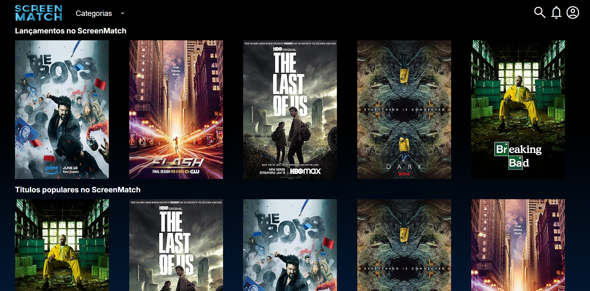
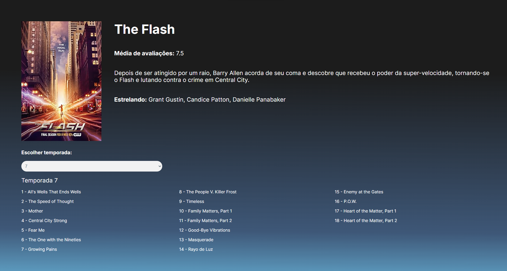

# Clone da Netflix com Spring Boot - API de Séries e Episódios
## Sobre o projeto
Este projeto é uma API desenvolvida para simular a plataforma Netflix, permitindo o gerenciamento de séries e episódios. Utilizando Spring Boot, o sistema foi projetado para ser escalável e eficiente, focando em boas práticas de desenvolvimento backend. O objetivo principal é oferecer uma experiência de usuário semelhante à Netflix, permitindo que os usuários busquem, visualizem e interajam com uma vasta biblioteca de conteúdo de entretenimento.
## Layout
### Tela inicial

### filtro de episodios por temporada

## Consumo de API externa
Iniciei o projeto consumindo dados de APIs externas utilizando a classe HttpClient. Isso me permitiu fazer requisições GET a um endpoint, capturando dados sobre séries e episódios em formato JSON, o que foi essencial para o funcionamento da aplicação.
```java
public class ConsumoApi {
    public String obterDados(String endereco) {
        HttpClient client = HttpClient.newHttpClient();
        System.out.println(endereco);
        HttpRequest request = HttpRequest.newBuilder()
                .uri(URI.create(endereco))
                .build();
        HttpResponse<String> response = null;
        try {
            response = client
                    .send(request, HttpResponse.BodyHandlers.ofString());
        } catch (IOException e) {
            throw new RuntimeException(e);
        } catch (InterruptedException e) {
            throw new RuntimeException(e);
        }

        String json = response.body();
        return json;
    }
}
```
## Criação de Endpoints REST
Implementei diversos endpoints REST no controller, permitindo que os usuários listassem séries, acessassem as cinco mais bem avaliadas e filtrassem lançamentos recentes. Utilizei anotações como @GetMapping e @PathVariable para capturar parâmetros dinâmicos e oferecer funcionalidades acessíveis.
```java
@RestController
@RequestMapping("/series")
public class SerieController {
    @Autowired
    private SerieService service;


    @GetMapping
    public List<SerieDTO> obterSeries(){
        return service.obterTodasAsSeries();
    }

    @GetMapping("/top5")
    public List<SerieDTO> obterTop5Series(){

        return service.obterTop5Series();
    }

    @GetMapping("/lancamentos")
    public List<SerieDTO> obterLancamentos(){
        return service.obterLancamentos();

    }
    @GetMapping("/{id}")
    public SerieDTO obterPorId(@PathVariable Long id ){
        return service.obterPorId(id);
    }

    @GetMapping("/{id}/temporadas/todas")
    public List<EpisodioDTO> buscaEpisodios(@PathVariable Long id){
        return service.buscaEpisodios(id);
    }
    @GetMapping("/{id}/temporadas/{temp}")
    public List<EpisodioDTO> buscaTemporada(@PathVariable Long id, @PathVariable Long temp){
        return service.buscaTemporada(id,temp);
    }

    @GetMapping("/categoria/{categoria}")
    public List<SerieDTO> buscaCategoria(@PathVariable String categoria){
        return service.buscarSeriePorCategoria(categoria);
    }

}
```
## Persistência de Dados com JPA
A persistência de dados foi gerida pelo JPA/Spring Data. Aprendi a criar consultas personalizadas usando a anotação @Query, o que otimizou as buscas e melhorou a performance da aplicação. Por exemplo, implementei queries que buscam séries por categoria e episódios lançados em anos específicos.
```java
public interface SerieRepository extends JpaRepository<Serie, Long> {

   Optional<Serie> findByTituloContainingIgnoreCase(String nomeSerie);

   List<Serie> findByAtoresContainingIgnoreCaseAndAvaliacaoGreaterThanEqual(String nomeAtor, Double avaliacao);

   List<Serie> findTop5ByOrderByAvaliacaoDesc();

   List<Serie> findByGenero(Categoria categoria);

   @Query("select s from Serie s WHERE s.totalTemporadas <= :totalTemporadas AND s.avaliacao >= :avaliacao")
   List<Serie> seriesPorTemporadaEAvalicao(int totalTemporadas, double avaliacao);

   @Query("SELECT e FROM Serie s JOIN s.episodios e WHERE e.titulo ILIKE %:trechoEpisodio%")
   List<Episodio> episodiosPorTrecho(String trechoEpisodio);

   @Query("SELECT e FROM Serie s JOIN s.episodios e WHERE s = :serie ORDER BY e.avaliacao DESC LIMIT 5")
   List<Episodio> topEpisodiosPorSerie(Optional<Serie> serie);

   @Query("SELECT e FROM Serie s JOIN s.episodios e WHERE s = :serie AND YEAR(e.dataDeLancamento) >= :anoLancamento")
   List<Episodio> episodiosPorAno(int anoLancamento, Optional<Serie> serie);

   @Query("SELECT s FROM Serie s " +
           "JOIN s.episodios e " +
           "GROUP BY s " +
           "ORDER BY MAX(e.dataDeLancamento) DESC")
   List<Serie> top5SeriePorDataDeLancamento();


   @Query("SELECT e FROM Serie s JOIN s.episodios e WHERE s.id = :id AND e.temporada = :temp")
   List<Episodio> buscaPorTemporada(Long id, Long temp);

}
```
## Uso de DTOs
Para melhorar a eficiência e a segurança da comunicação entre o backend e o frontend, implementei DTOs. Isso garantiu que apenas os dados relevantes fossem enviados ao cliente, evitando a exposição de informações desnecessárias do banco de dados.

## Configuração de CORS
Para permitir a comunicação entre o backend e o frontend, configurei CORS (Cross-Origin Resource Sharing). Essa configuração foi essencial para garantir que a aplicação funcionasse de forma integrada e segura.
```java
@Configuration
public class CorsConfig implements WebMvcConfigurer {
    @Override
    public void addCorsMappings(CorsRegistry registry){
        registry.addMapping("/**")
                .allowedOrigins("http://127.0.0.1:3254")
                .allowedMethods("GET", "POST", "PUT", "DELETE");
    }

}
```
## Tecnologias usadas
- **Java:** Linguagem principal do projeto, utilizada em conjunto com Spring Boot para o desenvolvimento da API.
- **Spring boot:** Framework que facilitou a criação de microserviços e a implementação de endpoints REST.
- **HttpClient:**  Utilizado para o consumo de APIs externas, permitindo a obtenção de dados de séries em formato JSON.
- **JPA/Spring Data:** Para a persistência de dados, facilitando a interação com o banco de dados PostgreSQL e a criação de consultas personalizadas.
- **PostgreSQL:** banco de dados relacional utilizado para armazenar informações sobre séries e episódios.


